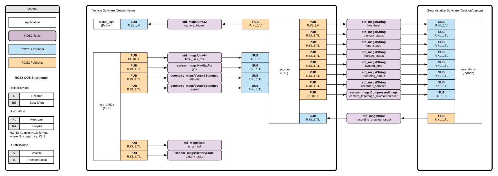

# Aqualink ASV

The Aqualink ASV is an open-source reference design for an autonomous surface vehicle. Included in this project are all hardware & electronics designs, software components, and instructions necessary to outfit a generic boat hull to navigate autonomously and collect camera and sensor data.

This project is designed around a collection of existing software projects, such as ROS2, Ardupilot, QGroundControl, and more. All hardware components are off-the-shelf with links to suppliers within the included [Bill of Materials](hardware/bill_of_materials.pdf) document. The construction process has been tailored to require no soldering and minimal, standard tools.

## Project Structure

The project is split into three main folders, each with their own setup guides:

- `groundstation/`: Contains setup instructions and software that will be run on a Linux laptop used to control the vehicle.
- `hardware/`: Contains all drawings & CAD (electrical and mechanical), assembly instructions and photos, and the bill of materials.
- `vehicle/`: Contains setup instructions and software for both the Nvidia Jetson Nano and Rambutan OpenWRT router that are installed in the vehicle electronics box.

While there is a great deal of flexibility in which order to read and follow the instructions, the order we recommend is:

1. Review all materials in `hardware/` to get an understanding of how everything fits together:
   - [Hardware Setup](hardware/README.md)
   - [System Diagram](hardware/drawings_and_cad/system_diagram.pdf)
   - [Electrical Connections](hardware/drawings_and_cad/electrical_connections.pdf)
   - [Bill of Materials](hardware/bill_of_materials.pdf)
2. Acquire all components, as specified by the BOM and your own project's requirements
3. Before assembling the hardware, set up the Nano and Rambutan router. These steps are easier pre-assembly:
   - [Nano Setup](vehicle/nano_setup.md)
   - [Router Setup](vehicle/router_setup.md)
4. Follow the instructions and drawings in the [Hardware Setup](hardware/README.md) to assemble the electronics and battery enclosures
5. Integrate the electronics and battery enclosures, motors, sensors, etc. into your vehicle hull
6. With the vehicle fully assembled, perform the [Pixhawk Setup](vehicle/pixhawk_setup.md)
7. At this point, your vehicle should be fully assembled, calibrated, and ready to deploy.

## Software Overview

Here is an image that shows the way all of the nodes connect together via ROS2 topics:

For more information on each software node, see:
  - [Groundstation Software](groundstation/README.md)
  - [Vehicle Software](vehicle/README.md)